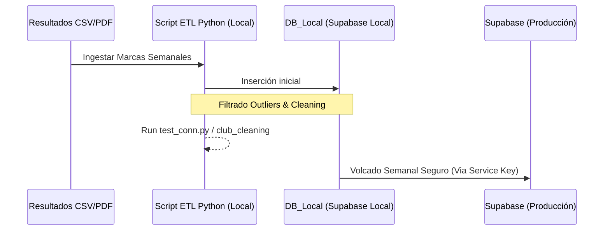
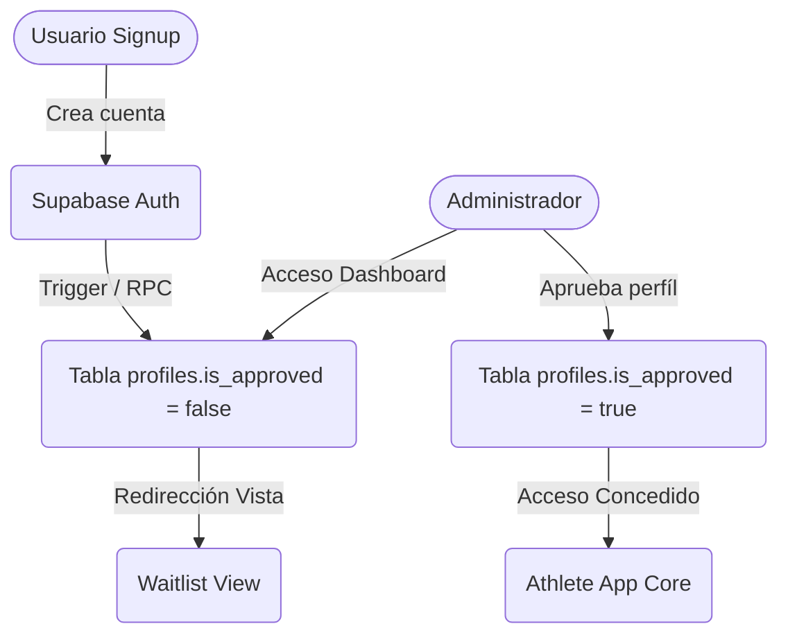
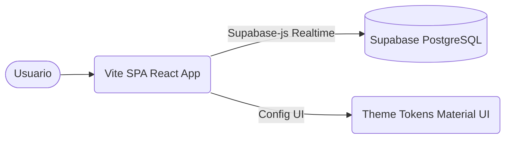

# 📊 Diagramas de Arquitectura (Mermaid)

### 1. Flujo de Sincronización de Base de Datos (Data Pipeline Semanal)

Este sistema evita inyectar datos corruptos (fallos en parseo, missing decimals) en el Supabase de Producción pasando antes por un Validador y DB Local.

### 2. Flujo de Aprobación de Registro Manual

### 3. Arquitectura Frontend a Backend (Vite SPA)

