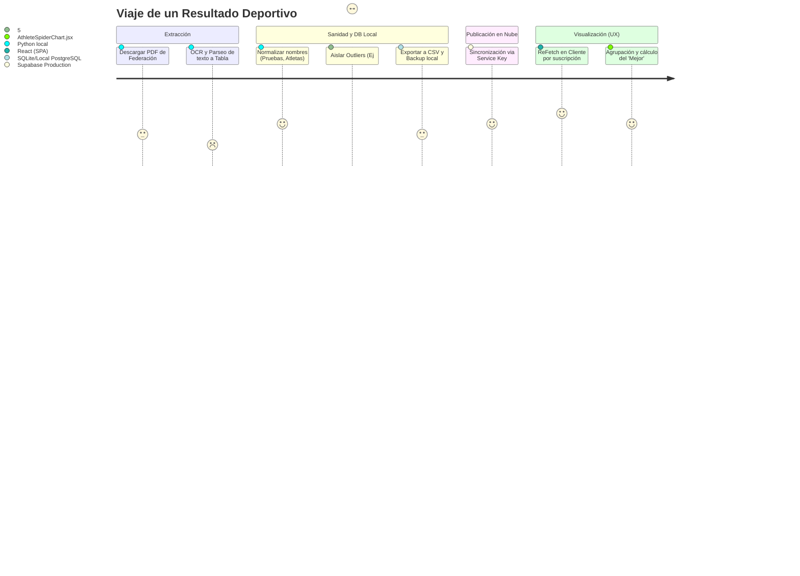

# 🧬 Ciclo de Vida del Dato

Este documento describe funcionalmente la travesía de una "Marca" deportiva desde su papel en PDF hasta transformarse en un punto dentro de la gráfica de Recharts en el Frontend. (Ref. de despliegue en [[Despliegue]]).

### Fase 1: Recolección y Volcado Seco (Preview Mode)
Como se detalla en `main.py --preview`:
1. El Scraper descarga todos los PDFs en `downloads/YYYY/MM`.
2. Se ejecuta un Parser OCR que trata de adivinar las filas tabulares.
3. Se normaliza el texto contra un diccionario maestro (`valid_events.txt`). Si hay una prueba no tipificada (e.g. `60m vallas invent`), el sistema levanta una advertencia.
4. Genera un `preview_YYYY-MM.csv` que el administrador puede ver y editar manualmente desde Excel.

### Fase 2: Ingesta BBDD Local y Seguridad de Respaldo
Como se detalla en `main.py --import-csv`:
1. El sistema crea forzosamente un Backup (`bbdd_backup_TIME.db`).
2. Descarga parámetros maestros (Categorías, IDs exactos) desde el Supabase de Producción a la memoria.
3. Inyecta el CSV en la Base de Datos Local limpiando objetos `NaN` y los inyecta mediante el `DBManager`.

### Fase 3: Renderizado en el Dispositivo del Usuario
Una vez syncronizados con Vercel/Supabase:
1. El componente React abre un abanico y descarga sus datos vía una query Joineada: resultados -> pruebas -> categorías.
2. Si la prueba es "60m" el array ordena a `min` value. Si es "Longitud", extrae el `max` value.
3. El Front-End renderiza sin recarga de página (*optimistic layout*) la vista final al ser avisada de posibles re-renders (`window.dispatchEvent('resultadoCreado')`).
