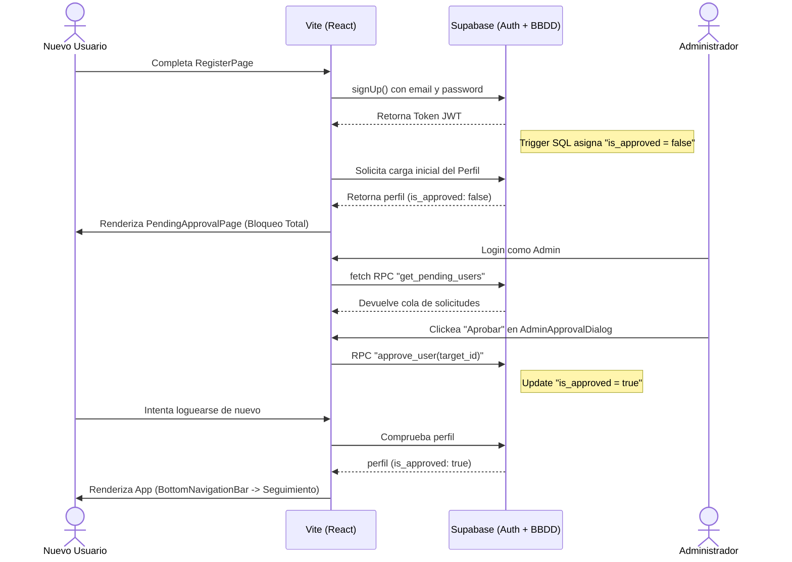

# 📱 Flujos de Pantalla (UX)

Este documento detalla los principales "caminos felices" (Happy Paths) y bloqueos dentro de la SPA (Single Page Application) construida en Vite/React (ver [[Frontend-Componentes]]).

## 1. Flujo de Aprobación de Usuarios (Onboarding)
El registro es abierto, pero el acceso **no** lo es. Este es un flujo de doble actor.

## 2. Flujo Principal del Dashboard: "SeguimientoPage"
Esta es la pantalla principal de retención. Está diseñada para ser consultada semanalmente.

1. **Estado Vacío (`loadSelectedAthlete = null`):** Al entrar, si la *cache* de `localStorage` está vacía, levanta el modal forzoso `SelectAthleteDialog` (Autocompletado de búsqueda en Base de Datos).
2. **Carga del Perfil:** El sistema renderiza la cabecera (Nombre, Año, Club).
3. **Despliegue de Componentes Dinámicos:**
   - **`NextEventCard`:** Busca en la tabla el próximo evento y lo sugiere.
   - **`AthleteSpiderChart`:** Engulle las "Mejores Marcas" y traza el perfil radar (Ver reglas de cálculo en [[Reglas-de-Negocio]]).
   - **`AthleteResultsChart`:** Imprime la evolución histórica en gráfico de líneas continuas.
4. **Acciones Rápidas (Menú de 3 puntos):**
   - **Comparar (`AddComparatorDialog`):** Al añadir un atleta, inyecta su trazo (rojo, verde, etc.) encima del spider chart original, redibujando ambos componentes subyacentes.

## 3. Navegación Inferior (Global Tab Bar)
El patrón de diseño usa un `BottomNavigationBar` (Mobile-First):
- 🏃 **Seguimiento:** Gráficas e histórico.
- 🔬 **Análisis:** Oculto para Rol Consulta (Ver [[Roles-Permisos]]).
- 📅 **Calendario:** Eventos del usuario logueado en una vista mensual.
- ⚙️ **Más:** Panel de Control y Configuración (Modos Administrador integrados visualmente aquí).
